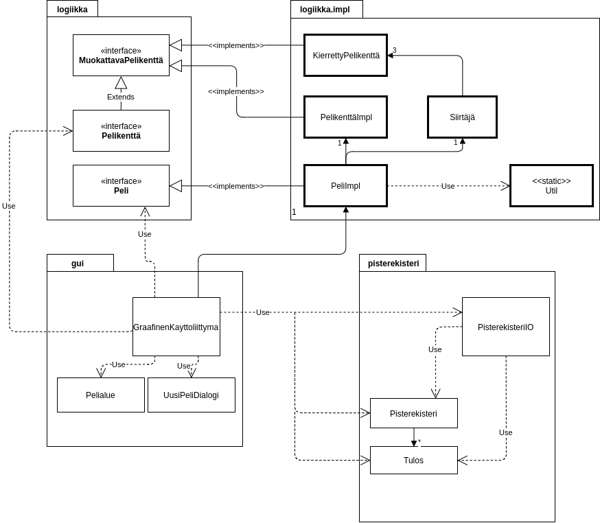
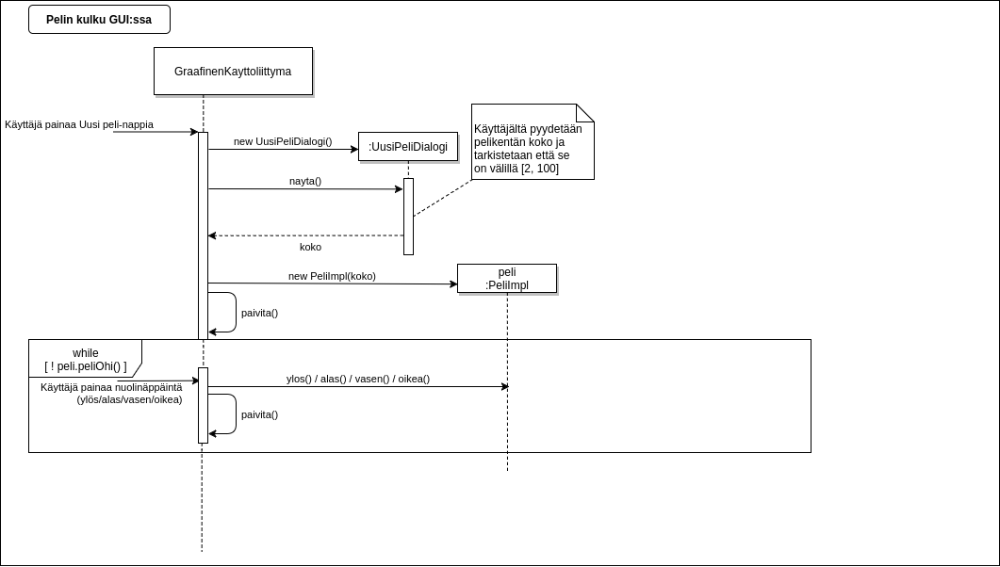
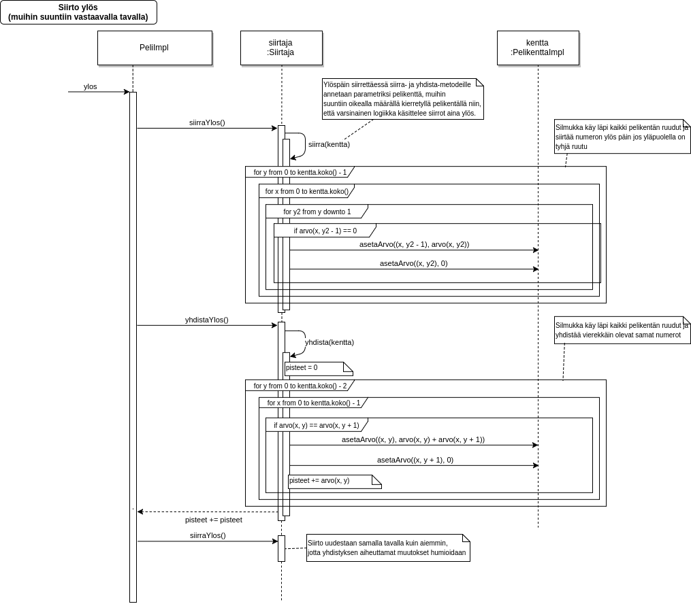

# 2^11

## Aiheen kuvaus

Klooni suositusta 2048-pelistä java-työpöytäpelinä. Alkuperäinen Gabriele Cirullin luoma peli löytyy osoitteesta: https://gabrielecirulli.github.io/2048/.

Kyseessä on peli, jonka pelikenttä on 4x4-kokoinen ruudukko, ja pelinappuloina toimivat laatikot, joiden arvot ovat kahden potensseja. Kun pelaaja painaa nuolinäppäintä (ylös, alas, vasemmalle tai oikealle) siirtyy kaikki luvut kyseiseen suuntaan, jos siinä suunnassa on tilaa liikkua. Kahden saman arvoisen luvun kohdatessa, ne yhdistyvät, ja luvuksi saadaan näiden summa, eli seuraava kahden potenssi (2n + 2n = 2*2n = 2n+1). Jokaisen siirron jälkeen ruudukkoon lisätään satunnaiseen tyhjään kohtaan kakkonen tai nelonen. Pelaajan peli loppuu, kun vapaita siirtoja ei ole. Alkuperäisessä pelissä, pelaaja voittaa pelin, kun ruudukolle saadaan luku 2048, mutta peliä voi jatkaa siitä hyvin paljon pidemmällekin. 

Pisteitä pelaajalle kertyy joka kerta kun kaksi lukua yhdistyy yhdeksi. Tässä tilanteessa pelaaja saa uuden luvun verran pisteitä.

Toteutetaan pelin laajennuksina pistetaulun ylläpito tiedosotossa ja käyttäjälle mahdollisuus valita ruudukon koko itse. Pisteet on pidettävä erillään eri kokoisten ruudukkojen kesken. 

Peliä käyttää vain yksi pelaaja kerrallaan, ja ainoa toiminto jonka pelaaja tekee vuorollaan, on painaa yhtä nuolinäppäintä.

## Ohjelman rakenne

Peli jakautuu kolmeen kokonaisuuteen: käyttöliittymään, logiikkaan ja pisterekisteriin. Logiikka ja pisterekisteri ei keskustele keskenään, vaan käyttöliittymä orkestroi koko kokonaisuutta. 

Logiikassa rajapinta ja toteutus on eriytetty toisistaan 'logiikka'- ja 'logiikka.impl'-paketteihin. Käyttöliittymä tulkitsee kaikki logiikan komponentit logiikka-paketista löytyvinä rajapintaolioina, lukuunottamatta uuden pelin konstruktointia, jossa joudutaan käyttämään PeliImpl-toteutuksen konstruktoria. 

Logiikan sisällä Peli-olio vastaa koko pelin tilanteen hallinnasta, ja varsinaisten siirtojen tekemeninen on ulkoistattu Siirtäjä-luokalle. Siirtäjä-luokkaan on toteutettu koodina vain ylöspäin tapahtuva siirto, muihin suuntiin tapahtuvissa siirroissa hyödynnetään KierrettyPelikenttä-luokkaa, joka on Pelikenttä-rajapinnan toteuttava luokka joka kuvaa pelikentän 90 astetta käännetyksi pelikentäksi.  

Pisterekisterissä yksittäinen tulos, itse rekisteri ja IO-toiminnot on hajautettu omiin luokkiinsa. Pisterekisterin formaatti noudattaa seuraavia sääntöjä:

- Tiedosto sisältää kahdenlaisia rivejä: Pelikentän koon määritteleviä rivejä ja tulosrivejä.
- Pelikentän koon määrittelevät rivit alkavat #-symbolilla jonka perään on heti pelikentän koko
- Pelikentän kokoa seuraavat rivit ovat tulosrivejä jotka sisältävät pelaajan nimen, sarkaimen, ja saadun pistemäärän.

### Luokkakaavio

### Sekvenssikaaviot
Pelin luonteesta johtuen erilaisia käyttötapauksia ei ole montaa. Alla olevissa kaavioissa on kuvattu yhden pelin kulku alusta loppuun, ja tarkemmalla tasolla mitä siirron aikana tapahtuu.

